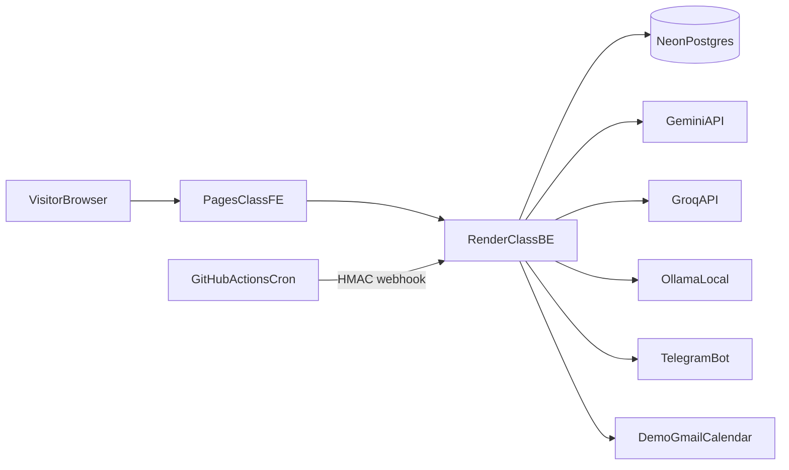

# OpsPilot Architecture

**Dualism:** Sections labeled **CURRENT** describe HEAD `41a8678` as verified. Sections labeled **TARGET** describe the locked rebuild (B0–B7). Do not present TARGET as shipped.

Master record: [OPSPILOT-MASTER-RECORD.md](../OPSPILOT-MASTER-RECORD.md) · ADRs: [docs/adr/](adr/) · Roadmap: [ROADMAP.md](../ROADMAP.md)

---

## Design principles

1. Ground CURRENT vs TARGET honestly.
2. Adapter / gateway first — providers are commodities.
3. Zero further spend; free tiers + Ollama; Anthropic prepaid-gated only (D-023).
4. Hermetic tests — no live LLM in default suite/CI.
5. Calm UX — chief-of-staff voice, not alert spam.
6. Complementary portfolio — hand-rolled gateway/agent; no LangGraph/Celery clone.

---

## CURRENT (HEAD 41a8678)

### Modules (path map)

| Path | Role |
|------|------|
| `src/opspilot/api/main.py` | FastAPI app, CORS localhost, routes |
| `src/opspilot/config/settings.py` | `AISettings` singleton (conversation only) |
| `src/opspilot/adapters/` | rule_based, claude, conversation, evening, insights, briefing, factory |
| `src/opspilot/pipeline/` | Daily ops orchestration |
| `src/opspilot/cli/` | CLI entry (`python -m opspilot.cli`) |
| `src/opspilot/schemas.py` | WorkItem / triage shapes |
| `frontend/src/` | React 19 + Vite UI |
| `data/raw/`, `data/output/`, `data/history/` | JSON sample + artifacts |
| **Missing** | `src/opspilot/__init__.py` |

### Endpoints (CURRENT)

Typical routes include: health, triage/run, briefing, ask, evening-summary, insights, runs, `GET`/`PATCH /api/settings`. Exact list is in `main.py`.

Notable: `PATCH /api/settings` can set provider/model/**API key** without auth (**SEC-01** — deploy gate). `/run` may spawn CLI **subprocess** (V3).

### Adapters / settings

- Conversation path uses `AISettings` (`OPSPILOT_AI_*` with `ANTHROPIC_API_KEY` fallback).
- Evening / insights / briefing / claude adapters still read env / hardcode model.
- Factory prefers Claude when a key is present → **non-hermetic tests** if `.env` has a key (V1).

### Data flow (files)

```
sample_input.json → pipeline → data/output (latest) + data/history/runs/...
Frontend fetch → FastAPI → adapters / file reads
```

No database. Settings overrides are in-memory only.

### Known defects (selected)

| ID | Issue |
|----|-------|
| V1–V3 | Non-hermetic / order-dependent tests; subprocess + missing package init |
| V4 / SEC-01 | Unauthenticated settings key mutation (deploy gate) |
| V5 | Vitest installed; zero FE tests |
| V6 | briefing_adapter wrong attribute names |
| V7 | npm audit / no TS `strict` |
| AI-01… | Duplicated LLM plumbing; no gateway resilience/evals |
| AI-05 | TriageRecord lacks real title/subject |

Full audit: [docs/audits/2026-09-25-baseline-audit.md](audits/2026-09-25-baseline-audit.md).

---

## TARGET

### Package layout + dependency rules

Keep `src/opspilot/` + `frontend/` (D-022). Evolve toward:

- `domain/` — WorkItem, Run, Preference, LlmCall, …
- `gateway/` — provider interface, routing, budget gate, structured outputs
- `agent/` — bounded tool loop (B5)
- `db/` — SQLAlchemy models + Alembic (B1)
- `evals/` — pytest harness (B3)
- Adapters become thin wrappers over the gateway — no direct SDK sprawl in feature modules.

**Dependency rule:** Feature code → domain/gateway; never import provider SDKs outside gateway.

### Domain model (minimum)

WorkItem, TriageRecord (with title/subject), Run, Preference, Approval, LlmCall (tokens/USD), SyncCursor (Gmail/Calendar), DemoMode flag.

### API `/api/v1`

Versioned REST under `/api/v1`. Env/operator settings — **no API-key PATCH from browsers**. SSE endpoint for Ask. Authenticated webhook for morning cron (B6).

### LLM gateway + Anthropic prepaid gate (D-012, D-023)

**Default order:** `gemini → groq → ollama → rules` (task-dependent). Anthropic **never** in default list.

Anthropic side channel: enable flag + allowlisted tasks + hard **token and USD** remaining budget; debit via LlmCall; fail closed. Never tests/CI; never visitor Ask (D12).

### Agent loop + approval boundary (D-014)

Bounded steps; read-only tools until B5 approve&send; human approval required before any send; DEMO visitors cannot send.

### Eval lanes (D-018)

| Lane | When | Anthropic? |
|------|------|------------|
| Deterministic | CI | No |
| Local model | Optional / nightly | No |
| Hosted free | Manual / weekly | No |
| Prepaid quality | Operator, budgeted | Yes, gated |
| Judge calibration | Manual subset | Optional gated |

Injection red-team shares the **same harness** as evals (B3).

### Security

- Env-only secrets; remove key from PATCH.
- Hermetic fakes in tests.
- Cron HMAC (X2).
- OAuth Testing forever; operator demo account only (D-016).
- Rate limits before public (B7).

### Frontend

Fetch + hooks (D-020). Vitest minimal suite; TS `strict` trajectory; panel lifecycle consistency; SSE AskPanel in B5. Design system retained (calm Anthropic-inspired palette).

### Jobs / scheduling

**CURRENT:** Manual CLI/API only; no in-app scheduler. Local Windows Task Scheduler remains a valid **dev** path.

**TARGET (B6):** GitHub Actions cron → authenticated backend webhook → morning triage/brief → Telegram notify (D-011, D-017). Tolerate free-tier cold starts. No Celery.

### Deployment topology (TARGET, B7)



No custom domain. Anthropic only via operator budgeted scripts, not visitor path.

### Deliberately simple

No LangGraph, LiteLLM, Celery, Qdrant, visitor BYOK, multi-tenant, LoRA, or MCP client in the locked spine.
