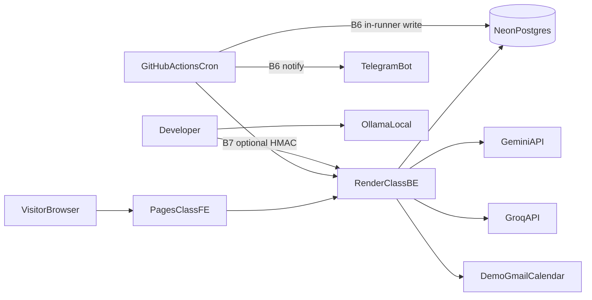

# OpsPilot Architecture

**Dualism:** Sections labeled **CURRENT** describe behavior on `main` through **B4** (gateway, evals harness, Gmail/Calendar). Sections labeled **TARGET** describe the remaining locked rebuild (**B3.1** live leaderboard rows + **B5–B7**). Do not present TARGET as shipped.

Master record: [OPSPILOT-MASTER-RECORD.md](../OPSPILOT-MASTER-RECORD.md) · ADRs: [docs/adr/](adr/) · Roadmap: [ROADMAP.md](../ROADMAP.md)

---

## Design principles

1. Ground CURRENT vs TARGET honestly.
2. Adapter / gateway first — providers are commodities.
3. Zero further spend; free tiers + Ollama; Anthropic prepaid-gated only (D-023).
4. Hermetic tests — no live LLM in default suite/CI.
5. Calm UX — chief-of-staff voice, not alert spam.
6. Complementary portfolio — hand-rolled gateway/agent; no LangGraph/Celery clone.

---

## CURRENT (B1–B4 on main)

Verified on `main` (B2 `0c71a4a`; B2.1 `7501b9e`; B3 `3eb7baf`; B4 `c6e677c`): hermetic pytest (socket block + `OPSPILOT_FORCE_RULES`), Postgres via Compose/CI, **sync** SQLAlchemy 2 + `psycopg`, Alembic head **0007**, `/api/v1` with envelope, FE on `/api/v1`, coverage fail-under **72**, Node ≥24.15 / Python 3.13 / uv.

**B1.5a:** Playwright visual/e2e/axe safety net with container-only `-linux` baselines; CSS partials; `useOverlay`; D-026/D-027.

**B1.5b (CURRENT):** ≥1280 three-pane shell; Ask dual-mode; All Items list+detail.

**B2 (CURRENT):** hand-rolled `opspilot.llm` gateway; `llm_allowed()`; services; free-tier providers + D-023; `LlmCall` + UTC budgets; runs pagination; `X-Request-ID`; timestamptz.

**B2.1 (CURRENT):** recursive meta redaction; OpenRouter `:free` gate; OBS request_id; dead-adapter delete; Alembic `0005`; toolchain pins.

**B3 (CURRENT):** eval harness `b3-live/v2`; triage N=40 + red-team N=20; hermetic F1 floor 0.30; live D1–D3 full; CF D4 partial 33/60; Alembic `0006` confidence/evidence_refs.

**B4 (CURRENT):** Gmail/Calendar OAuth PKCE + Fernet credentials; SyncCursor; Meeting; DEMO_MODE; operator session cookie (D-030); Connections/WeekPanel; Alembic **0007**.

### Endpoints (CURRENT) — `/api/v1`

Primary surface is **`/api/v1/*`**. Legacy unversioned routes were removed in B1.

| Method | Path |
|--------|------|
| GET | `/api/v1/health` |
| GET | `/api/v1/settings` (read-only; no key material) |
| POST | `/api/v1/runs` (in-process pipeline + Postgres persist) |
| GET | `/api/v1/runs`, `/api/v1/runs/{run_id}` |
| GET | `/api/v1/triage` (includes AI-05 lite `subject_or_title`) |
| GET | `/api/v1/briefing`, `/api/v1/ai-briefing` |
| GET | `/api/v1/runs/{run_id}/triage`, `.../briefing`, `.../ai-briefing` |
| POST | `/api/v1/ask`, `/api/v1/evening-summary`, `/api/v1/insights` |
| GET | `/api/v1/inputs`, `/api/v1/capabilities`, `/api/v1/capabilities/{capability_id}` |
| GET | `/api/v1/oauth/google/start`, `/api/v1/oauth/google/callback` |
| DELETE | `/api/v1/oauth/google` |
| POST | `/api/v1/sync` |
| GET | `/api/v1/calendar/week` |

Notable: **no** `PATCH` settings. Pipeline runs **in-process** (no CLI subprocess).

### Modules (path map)

| Path | Role |
|------|------|
| `src/opspilot/api/app.py` | FastAPI app + `/api/v1` |
| `src/opspilot/api/v1/` | Versioned routes + `oauth_routes.py` |
| `src/opspilot/persistence/` | SQLAlchemy models + engine |
| `src/opspilot/jobs/import_json.py` | X5 importer |
| `src/opspilot/pipeline/` | Daily ops orchestration (`run_daily_ops.py`) |
| `src/opspilot/adapters/` | `rule_based`, `gateway_triage`, `briefing_adapter`, `factory`, `base` |
| `src/opspilot/evals/` | Hermetic + live eval harness |
| `frontend/src/api/` | `/api/v1` client only |
| `frontend/src/styles/` | CSS partials (`tokens`, `shell`, `mobile`, `desktop`, `overlays`, `dashboard`, `pages`) |
| `frontend/src/components/PrimaryRail.tsx` | ≥1280 primary nav rail |
| `frontend/src/components/AskDock.tsx` | Docked Ask + shared `AskThreadBody` |
| `frontend/src/hooks/useOverlay.ts` | Shared overlay lifecycle (X8 start) |
| `frontend/src/hooks/useMinWidth.ts` | Ask dual-mode breakpoint (first-render matchMedia) |
| `frontend/e2e/` | Playwright visual/e2e/axe + font fixtures |
| `data/raw/` | Sample JSON inputs (API/CLI read) |
| `data/output/`, `data/history/` | CLI `--output` export only (not API SoT) |

### Data flow (CURRENT)

```
Disconnected: sample_input.json → in-process pipeline → Postgres (runs, artifacts, triage, work_items)
Connected:    Gmail/Calendar sync → Postgres work_items/meetings → capped triage (gmail-only surfaces)
CLI:          run --output DIR → files under DIR only (no Postgres)
X5:           import_json (sample / CLI export / history) → Postgres (idempotent)
FE → /api/v1 → Postgres (local or Neon for operator demo)
```

---

## Historical CURRENT notes (pre-B1) — archived context

The following bullets described HEAD before B1 and are retained only as audit trail. They are **not** CURRENT after B1.

<details>
<summary>Pre-B1 endpoint table (removed)</summary>

Legacy unversioned routes and subprocess `/run` — deleted in B1.

</details>

### Adapters / settings (historical — superseded on B2 branch)

- Pre-B2: Conversation used `AISettings` / Anthropic; evening/insights/briefing/claude called Anthropic directly; FORCE_RULES was triage-factory-only.
- **B2:** `llm_allowed()` + gateway/services; Anthropic only via D-023; see CURRENT section above.

### Data flow (files + DB)

```
sample_input.json → pipeline → data/output (latest) + data/history/runs/...
Frontend fetch → FastAPI → adapters / file reads
```

No database. Settings overrides are in-memory only.

### Known defects (selected)

| ID | Issue |
|----|-------|
| V1–V3 | Non-hermetic / order-dependent tests; subprocess + missing package init |
| V4 / SEC-01 | Unauthenticated settings key mutation (deploy gate) |
| V5 | Vitest installed; zero FE tests |
| V6 | briefing_adapter wrong attribute names |
| V7 | npm audit / no TS `strict` |
| AI-01… | Duplicated LLM plumbing; no gateway resilience/evals |
| AI-05 | TriageRecord lacks real title/subject |

Full audit: [docs/audits/2026-09-25-baseline-audit.md](audits/2026-09-25-baseline-audit.md).

---

## TARGET

### Package layout + dependency rules (D-024)

Keep `src/opspilot/` + `frontend/` (D-022). TARGET tree (principal-review §2.1):

```
src/opspilot/
  __init__.py
  api/
    app.py
    deps.py
    errors.py                 # single error envelope
    v1/
      routes_health.py
      routes_runs.py
      routes_triage.py
      routes_ask.py           # + SSE
      routes_drafts.py
      routes_prefs.py
      routes_admin.py         # settings read-only
  domain/
    models.py
    enums.py
  services/
    triage_service.py
    briefing_service.py
    ask_service.py
    sync_service.py
    draft_service.py
    preference_service.py
  llm/
    gateway.py
    types.py
    routing.py
    budgets.py
    prompts/
    providers/
      gemini.py
      groq.py
      ollama.py
      anthropic.py            # prepaid gated only
  agent/
    loop.py
    tools/
      search_items.py
      get_message.py
      get_calendar.py
      draft_reply.py
      send_reply.py
    events.py
  integrations/
    google_oauth.py
    gmail_client.py
    calendar_client.py
  persistence/
    db.py
    repositories/
    migrations/               # Alembic
  jobs/
    morning_run.py
    sync_mail.py
  evals/
    datasets/
    metrics/
    runners/
  obs/
    tracing.py
    metrics.py
  config/
    settings.py               # env-only secrets
  rules/
    triage_rules.py
```

**Dependency rules:**

- `api` → `services` → (`domain`, `llm`, `agent`, `integrations`, `persistence`)
- `agent` → `llm` + read services; never `integrations.send` without approval service
- `evals` may use `rules` + LLM fakes; never load `.env` keys in CI lane
- `integrations` must not import `api`
- No upward imports from `llm` into `api`
- Provider SDKs only inside `llm/providers/`

### Domain model (minimum)

| Entity | Key fields | Relationships |
|--------|------------|---------------|
| **User** | id, email, google_sub, role=`demo_operator`\|`visitor` | 1:n runs, prefs |
| **WorkItem** | id, source, subject, body, sender, received_at, thread_id, provider_id **unique**, raw_json | n:1 Thread |
| **Thread** | id, subject, participants | 1:n WorkItems |
| **TriageDecision** | urgency, category, sentiment, reasons, **confidence**, **evidence_refs**, model, prompt_version | n:1 WorkItem |
| **Commitment** | text, due_at, status | DEFER table OK empty |
| **Meeting** | calendar_event_id, start, end, title, attendees | |
| **Draft** | work_item_id, body, status=`pending`\|`approved`\|`sent`\|`rejected` | |
| **Approval** | draft_id, user_id, decided_at, decision | |
| **Preference** | key, value, source=`user_correction` | |
| **Feedback** | triage_decision_id, correct_label?, note, promoted_to_eval | |
| **Run** | kind=`morning`\|`manual`\|`sync`, status, started_at, stats | |
| **LlmCall** | task, provider, model, latency_ms, ttft_ms, tokens_in/out, USD fields, prompt_version, status | |
| **DemoMailbox** | fictional account binding (operator-only) | |
| **SyncCursor** | provider sync checkpoints (X1) | |

### API `/api/v1`

- Prefix: **`/api/v1`**
- Error envelope: `{ "error": { "code": str, "message": str, "details": object|null } }`
- Auth: session cookie (HTTP-only) after Google OAuth for operator; visitor = read-only demo, no Google link
- Rate limit: per IP + per user on LLM routes
- Streaming: `POST /api/v1/ask/stream` → `text/event-stream`
- Settings: `GET /api/v1/settings` **read-only** (no keys); **no** key PATCH

**Current → future map**

| Current | Future |
|---------|--------|
| `GET /health` | `GET /api/v1/health` (+ `GET /api/v1/ready` checks DB) |
| `GET/PATCH /api/settings` | `GET /api/v1/settings` read-only; **remove PATCH** |
| `POST /run` | `POST /api/v1/runs` (in-process; no subprocess) |
| `GET /briefing`, `/ai-briefing` | `GET /api/v1/briefings/latest` |
| `GET /triage` | `GET /api/v1/triage` |
| `GET /runs*` | `GET /api/v1/runs`, `.../{id}` |
| `POST /ask` | `POST /api/v1/ask` + `/ask/stream` |
| `POST /evening-summary` | `POST /api/v1/evening-summary` |
| `POST /insights` | `POST /api/v1/insights` |
| `GET /inputs` | remove or admin-only |
| `GET /capabilities*` | keep as product roadmap UI or static |

### LLM gateway + Anthropic prepaid gate (D-012, D-023)

```text
complete(task, messages, schema=None) -> Result
stream(task, messages) -> AsyncIterator[Event]
```

**Default order:** `gemini → groq → ollama → rules` (task-dependent). Anthropic **never** in the default list.

- **Failover:** on 429/5xx/timeout; honor Retry-After; circuit open N minutes
- **Budgets:** daily req/token caps per free provider from env; Anthropic hard **token and USD** remaining (D-023)
- **Structured output:** native JSON schema/mode → Pydantic; retry once; fail closed
- **Prompts:** `llm/prompts/{name}/v{N}.md` + sha256 in `LlmCall`
- **Tracing:** `obs.tracing` + persist `LlmCall`
- Anthropic: enable flag + allowlisted tasks only; never tests/CI; never visitor Ask (D2/D11)

### Agent loop + approval boundary (D-014)

- Tools as JSON schemas; allowlist in config: `search_items`, `get_message`, `get_calendar`, `draft_reply`, `send_reply`
- Max steps (e.g. 5), max wall time, max tokens
- Read-only tools until approve&send; `send_reply` requires approved `approval_id`
- SSE events: `token`, `tool_start`, `tool_end`, `final`, `error`
- DEMO_MODE visitors cannot send

### Eval lanes (D-018) + amendment

| Lane | When | Anthropic? |
|------|------|------------|
| Deterministic | Always CI | No |
| Local model | CI optional / nightly | No |
| Hosted free | Manual / weekly | No |
| Prepaid quality | Operator, budgeted | Yes, gated |
| Judge calibration | Manual subset | Optional gated |

Datasets under `evals/datasets/` (fictional). Metrics: precision/recall/F1, confusion matrix, groundedness (ID citation). **No LLM-as-judge in B3 (P6).** Injection red-team shares the **same harness** (B3). Hermetic CI = defense fixtures + rules-vs-labels F1 gate; **live ASR** reported per provider in `docs/evals/` (not a CI gate; D-029).

### Security

- Secrets: env / host secret store only; FE never sees keys
- Auth: Google OAuth operator; visitors anonymous read-only
- Injection: system prompt policy + **untrusted-content delimiters** around item-derived text + hermetic red-team fixtures (live ASR reported, not CI-gated)
- PII: fictional policy; if detector fires → **Ollama-only** path
- X2 HMAC `POST /api/v1/jobs/morning` — **B7 optional** only (D-011); B6 does not need public webhook
- Rate limits before public (B7)
- DEMO_MODE blocks send for visitors

### Frontend

- React Router; panels on shared `useOverlay` (**X8 started in B1.5a**; agent Ask chrome finishes on **B1.5b layout in B5**)
- Fetch + React state (D-020); TanStack Query only if cache pain appears
- SSE: EventSource or fetch stream reader in AskPanel
- PWA out of spine; Telegram link in settings for operator
- Types: OpenAPI-lite generated/checked in CI (X7 in B1)
- B1 exits: TS `strict` on; minimal vitest in CI; react-router upgraded (`npm audit --omit=dev` 0 high)
- B1.5a: container-only `-linux` visual baselines (D-026); CSS split; U4 hygiene

### Jobs / scheduling

**CURRENT:** Manual CLI/API only; no in-app scheduler. Local Windows Task Scheduler remains a valid **dev** path.

**TARGET B6 (D-011):** GitHub Actions cron runs `morning_run` **inside the runner** (install package; GHA secrets for Gemini/Groq, Neon URL, Telegram token, token-encryption key; Google refresh token read encrypted from Neon). Writes Neon; notifies Telegram. **No public backend** before B7. Fail fast if Neon schema ≠ Alembic head; migrations are operator-applied, never by cron. Auth failure → skip sync, brief from existing data, Telegram re-auth alert.

**TARGET B7:** Public deploy; optional HMAC webhook wake of deployed API (X2).

### Deployment topology



No custom domain. Anthropic only via operator budgeted scripts, not visitor path. Ollama is **local/CI only** — not wired from deployed BE.

### Deliberately simple

No LangGraph, LiteLLM, Celery, Qdrant, visitor BYOK, multi-tenant beyond operator vs visitor, LoRA, MCP client, or custom domain in the locked spine.
