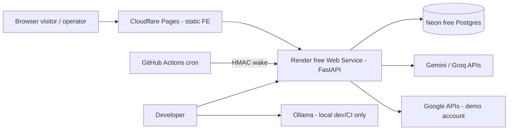

# OpsPilot AI — Principal Review: Target Architecture, Docs System & Roadmap

**Review date:** 2026-09-26  
**Mode:** Ask / read-only  
**HEAD:** `41a867828c61815b50579114ec127cb80b33c3ff` · `main` · clean — VERIFIED  
**Purpose:** Lock the plan that M0 will record. Challenge weak scope; prefer large batches a solo engineer can finish.

---

## 0. Executive summary

**Overall verdict:** The direction is right — **gateway + hermetic foundation + real demo inbox + bounded agentic Ask + evals** is a coherent AI-engineering portfolio story that complements (does not clone) a LangGraph/RAG/Celery stack. The current proposal is **too large for a solo developer** if P1–P11 and A1–A5 are all treated as near-term. Lock a **thin spine**; put everything else on an explicit CUT / DEFER list with triggers.

**Top changes I recommend**

1. **Downgrade SEC-01 severity for localhost; keep it as a hard deploy gate** — AGREE with V4.
2. **Treat V1–V3 as P0 foundation bugs**, not polish — they poison every AI milestone.
3. **Move A4 tracing hooks into A1**; Phoenix UI can wait. Observability after P4 is too late.
4. **Run A2 (evals) before or in parallel with P1** — synthetic corpus does not need Gmail.
5. **Put A3 (injection) before P2** — agent tools that open email bodies amplify indirect injection.
6. **Shrink P8** from evidence spans + confidence everywhere → **item-ID grounding + confidence on triage first**.
7. **Cut or deep-defer P6, P7, P10, A5, MCP, attachments** from the locked roadmap; keep as backlog.
8. **Pick one notification channel later (P11)** — prefer Telegram bot over full PWA+push for free-tier simplicity.
9. **DB: Neon Postgres (or Turso) — not SQLite-on-ephemeral-disk** — AGREE with free-host constraint; VERIFY tier at decision time.
10. **Auth: Google OAuth for the demo operator only** — visitors never connect Gmail (constraint already correct).

### CUT LIST (do not schedule in M1–M_n spine)

| Item | Why cut from locked roadmap |
|------|-----------------------------|
| **P6** Commitment tracking | Product gold, but needs sent-mail corpus + chase loop; after P3 proven |
| **P7** Meeting prep | Depends on calendar sync + retrieval quality; after P1+P9 lite |
| **P10** Multilingual | Doubles eval surface; no product user yet |
| **A5** LoRA distillation | Stretch anti-signal until eval platform + teacher quality exist |
| **Backlog: MCP client** | Full overlap with other repo; no product need yet |
| **Backlog: attachments / vision** | After P1 stable |
| **Full PWA + web push** | Prefer Telegram later; push certs/VAPID add ops without portfolio gain |
| **LiteLLM / LangGraph / Celery / Qdrant** | Explicitly out unless a later trigger |
| **Visitor BYOK / public Gmail connect** | Zero-spend + OAuth assessment traps |
| **Custom domain** | Constrained out |

**Keep as spine:** F3 → F1 → A1(+A4 hooks) → A2 → A3-lite → P1 → P2 → P3 → P4 → P5-lite → F2 → (optional A5 / P6–P11).

---

## 1. Item verdicts

### V — Verified findings

#### V1. Non-hermetic tests / real Anthropic under local `.env` — **AGREE**

| | |
|--|--|
| **Evidence** | `/run` spawns CLI subprocess (`main.py:239–259`). Pipeline `load_dotenv()` (`run_daily_ops.py:30–32`). `get_adapter()` prefers `ClaudeAdapter` when key present (`factory.py:12–24`). Several API tests call real `/run` without faking the LLM (`test_api.py:34–37`, `:102–103`, `:203–205`, etc.). `test_get_triage` / `test_get_briefing` read real `API_OUTPUT_DIR` (`main.py:34`, `test_api.py:80–93`) with **no** `isolated_run_dirs`. |
| **~120 calls** | 13 sample items × (~9 successful unmocked pipeline runs) + briefings ≈ order of **~100–130** LLM calls — **INFERRED** magnitude; owner’s ~120 is plausible. |
| **CI difference** | CI has no key → `ClaudeAdapter` raises → rules path — **INFERRED** from factory + CI workflow earlier. |
| **Deps / effort / risk** | Blocks honest AI work. **L** to fix properly. **High** risk of silent spend. |
| **Zero-spend** | **Silent violation** whenever `.env` has Anthropic key during pytest. |

#### V2. Order-dependent tests / real `data/output` — **AGREE**

| | |
|--|--|
| **Evidence** | `test_get_triage` / `test_get_briefing` have no temp-dir fixture (`test_api.py:80–93`). `isolated_run_dirs` only used on subset (`:16–21`, `:96+`). Default dirs are repo `data/output` and `data/history` (`main.py:34–35`). |
| **Solo 404** | **INFERRED** confirmed by logic: alone → no prior `/run` → 404. |
| **Effort** | **M** with F1. |

#### V3. Subprocess CLI + missing package `__init__.py` — **AGREE**

| | |
|--|--|
| **Evidence** | `subprocess` + `python -m opspilot.cli` (`main.py:239–250`). **No** `src/opspilot/__init__.py` (Test-Path False) — VERIFIED; only nested `__init__.py` under adapters/config/capabilities. Implicit namespace package is fragile across editable installs / stale venvs. |
| **Windows 8 failures** | Owner report — **VERIFY AT DECISION TIME** on this machine; mechanism is sound. |
| **Effort** | **S–M** (in-process call + add `__init__.py`). |

#### V4. SEC-01 severity downgrade for local — **AGREE (MODIFY wording)**

| | |
|--|--|
| **Evidence** | CORS allowlist localhost only (`main.py:38–41`, `66–71`). PATCH `/api/settings` unauthenticated (`:210–230`). Uvicorn default bind is loopback when started as README shows — **INFERRED** (README does not pass `--host 0.0.0.0`). |
| **Verdict** | **Deploy blocker / pre-exposure gate**, not “drop everything local emergency.” Still **must** fix before any public bind or tunnel. |
| **Effort** | **S** (env-only keys; remove key from PATCH). |

#### V5. Vitest installed, zero tests, `npm test` fails — **AGREE**

| | |
|--|--|
| **Evidence** | `frontend/src/test/setup.ts` exists (1 line). Glob of `*.test.*` / `*.spec.*` under `frontend/src` → **none**. `package.json` `"test": "vitest"`. CHANGELOG still claims FE tests — doc lie. |
| **Effort** | **M** to add a minimal suite + CI job. |

#### V6. `briefing_adapter` wrong attribute names — **AGREE**

| | |
|--|--|
| **Evidence** | `briefing_adapter.py:49` uses `item.subject` / `item.title`. `WorkItem.subject_or_title` (`schemas.py:28–35`). |
| **Effort** | **S**. |

#### V7. npm audit advisories + no `strict` — **AGREE (partial)**

| | |
|--|--|
| **tsconfig** | No `"strict": true` — VERIFIED (`tsconfig.app.json`). |
| **npm audit** | Not re-run this session — **VERIFY AT DECISION TIME**; treat owner report as accepted until CI `npm audit` gate. |
| **Effort** | **S–M**. |

---

### P — Product features

#### P1. Real inbox + calendar (demo account, fictional mail) — **AGREE (MODIFY)**

| | |
|--|--|
| **Modify** | Seed **fictional** mail only; **Testing** OAuth audience; **no visitor Gmail connect**. Prefer narrow scopes; treat `gmail.readonly`-class as restricted (assessment if published) — design stays in Testing forever for public demo. Calendar similarly. Replace `sample_input.json` path and static `WeekPanel.tsx:15–21`. |
| **Zero-spend** | Google APIs free within quotas — VERIFY; **no** paid CASA if you never leave Testing / never onboard external users. |
| **Effort / risk** | **XL** / High (OAuth, sync, idempotency). |
| **Deps** | F1 persistence, A1, A3-lite before agent reads bodies. |

#### P2. Agentic Ask (tools + multi-turn + SSE) — **AGREE (MODIFY)**

| | |
|--|--|
| **Modify** | Hand-rolled loop only; hard step cap (e.g. 4–6); tools **read-only** until P3; stream tokens + tool events via SSE. No LangGraph. |
| **Effort / risk** | **XL** / High (quota burn on free tiers). |
| **Deps** | A1, A2 (regression), A3-lite, P1 for real tools (can stub tools on JSON first). |

#### P3. Draft → approve → send — **AGREE**

| | |
|--|--|
| **Reason** | Real HITL that is **product-native** and lighter than other-repo LangGraph HITL — complementary. `gmail.send` is sensitive (verification if public) — stay Testing. |
| **Effort** | **L**. **Deps:** P2 tools + auth. |

#### P4. Proactive morning run + notification — **AGREE (MODIFY)**

| | |
|--|--|
| **Modify** | GitHub Actions cron → authenticated backend webhook (free on public repo). Notification: **Telegram bot first** (P11 lite), not full web push. |
| **Zero-spend** | Cold starts on free web tier — design cron to tolerate wake latency. |
| **Effort** | **L**. **Deps:** F1 pipeline in-process, F2 or minimal public URL, A1. |

#### P5. Learns priorities — **AGREE (MODIFY → lite)**

| | |
|--|--|
| **Modify** | Store corrections as `Preference` + promote to **eval cases** (A2). Do **not** build online learning. Simple weighted rules / prompt snippets first. |
| **Effort** | **L**. **Deps:** A2, persistence. |

#### P6. Commitment tracking — **DEFER** (cut from spine)

Trigger: P3 sending works + 2+ weeks of demo sent mail.

#### P7. Meeting prep — **DEFER**

Trigger: P1 calendar stable + P9 lite search.

#### P8. Grounded answers + confidence — **MODIFY**

| | |
|--|--|
| **Modify** | Phase 1: cite **item/message IDs**; triage **confidence** + “review” flag. Phase 2: evidence **spans** only after eval metrics exist. Full span grounding is XL and flaky on free models. |
| **Effort** | Phase 1 **M–L**; full spans **XL**. |

#### P9. Inbox history search — **MODIFY**

| | |
|--|--|
| **Modify** | **Postgres FTS first**; embeddings/`sqlite-vec`/`pgvector` only if FTS fails product need. Local embedding model (fastembed-like) if vectors added — free/local. **Not** hosted Pinecone. |
| **Effort** | FTS **M**; semantic **L**. **Overlap:** partial with other repo’s RAG — keep thinner. |

#### P10. Multilingual — **REJECT** for locked roadmap

No users; doubles A2. Revisit only if demo persona requires it.

#### P11. PWA/push or Telegram — **MODIFY → Telegram later**

| | |
|--|--|
| **Prefer** | Telegram bot for P4 notifications (simple, free). |
| **Defer** | Installable PWA + web push (VAPID, browser matrix). |
| **Effort** | Telegram **M**; PWA+push **L–XL**. |

---

### A — AI-engineering capabilities

#### A1. LLM gateway — **AGREE**

| | |
|--|--|
| **Must include** | Gemini + Groq + Ollama; Anthropic optional; failover; retries; timeouts; circuit breaker; budgets; structured outputs; versioned prompts; **trace hooks**. Replace five Anthropic clients. |
| **Zero-spend** | No Cerebras/card trials; no paid OpenRouter tier; never require Anthropic in tests. |
| **Effort** | **XL** as a batch with adapter migration. |

#### A2. Eval platform — **AGREE (MODIFY)**

| | |
|--|--|
| **Modify** | Custom pytest harness CORE. DeepEval/promptfoo **optional later**. Leaderboard driving routing: **v1 = manual config from measured table**, not auto-optimizer. Model-as-judge only on **Ollama** in default CI (or skip judge in secret-free lane). |
| **Effort** | **XL**. |

#### A3. Security (injection + red-team + PII→Ollama) — **AGREE (MODIFY)**

| | |
|--|--|
| **Modify** | Delimiters + policy tests + red-team suite in CI first. Full Presidio **when real PII risk** (demo fictional → lite detectors OK). PII→Ollama routing: good pattern; implement when classifier exists. |
| **Effort** | **L** lite; **XL** full. **Schedule before P2.** |

#### A4. Observability OTel + Phoenix — **MODIFY**

| | |
|--|--|
| **Modify** | **Hooks + JSONL/OTel export in A1**. Phoenix UI as later ops nicety (after F2 or late). Don’t block product on Phoenix. |
| **Effort** | Hooks **M**; Phoenix **M**. |

#### A5. LoRA distill — **DEFER / stretch only**

After A2 has stable teacher metrics. Free Kaggle/Colab only. Not in spine.

---

### F — Foundation

#### F1. Engineering fixes — **AGREE**

In-process pipeline; async where I/O-bound; persistence; env-only keys; hermetic tests; `__init__.py`; lockfile; CI (ruff, mypy, coverage, vitest, gitleaks, Dependabot); react-router; TS strict; fix V6.  
**Effort:** **XL** as one mega-batch — consider split **F1a hermetic/security** then **F1b quality gates** if needed, still “large batches.”

#### F2. Deploy — **AGREE (MODIFY)**

| | |
|--|--|
| **Modify** | FE: Cloudflare Pages / similar. BE: Render free (sleeps ~15m) — VERIFY. DB: Neon free (not Render free Postgres 30-day expiry trap) — VERIFY. Google login for **demo operator**. Rate limits. Cron via GHA. Load test lite (k6/hey free). Retention/deletion. **No custom domain.** |
| **Order** | After P3–P4 story works locally; don’t deploy empty gateway. |
| **Effort** | **XL**. |

#### F3. Records & docs — **AGREE** — **M0**

Master record + ADRs + architecture + README metrics placeholder.  
**Effort:** **M–L**.

---

### Backlog

| Item | Verdict |
|------|---------|
| Attachment / Gemini vision | **DEFER** |
| MCP client | **REJECT** near-term (overlap) |
| Local voice (faster-whisper / Piper) | **DEFER** (UI mic already scaffolded) |

---

### Missing items a principal would insist on

| ID | Item | Why |
|----|------|-----|
| **X1** | Idempotent sync + `provider_message_id` uniqueness | P1 without this corrupts DB |
| **X2** | Webhook auth for GHA cron (HMAC secret) | P4 without this is free RCE-ish |
| **X3** | Feature flags / `DEMO_MODE` | Public site must never call real send |
| **X4** | Prompt/data minimization policy in AGENTS | Free tiers may train |
| **X5** | Migration from JSON history → DB with one importer | Preserve demo continuity |
| **X6** | Explicit “Anthropic forbidden in pytest” guard | Prevent V1 recidivism |
| **X7** | OpenAPI versioned contract + FE types generation (optional lite) | Stops API drift |
| **X8** | Panel lifecycle standard (FE) | Known debt; do in FE batch |

---

## 2. Target architecture (concrete)

### 2.1 Backend package layout

Keep `src/opspilot/` + `frontend/` (ADR: no monorepo restructure).

```
src/opspilot/
  __init__.py                 # explicit package
  api/
    app.py                    # FastAPI factory, middleware
    deps.py                   # auth, db session
    v1/
      routes_health.py
      routes_runs.py
      routes_triage.py
      routes_ask.py           # + SSE
      routes_drafts.py
      routes_prefs.py
      routes_admin.py         # settings read-only
    errors.py                 # single envelope
  domain/
    models.py                 # SQLAlchemy/SQLModel entities
    enums.py
  services/
    triage_service.py
    briefing_service.py
    ask_service.py
    sync_service.py           # Gmail/Calendar pull
    draft_service.py
    preference_service.py
  llm/
    gateway.py                # complete / stream / complete_json
    types.py
    routing.py                # task → provider order
    budgets.py
    prompts/                  # versioned markdown/yaml
    providers/
      gemini.py
      groq.py
      ollama.py
      anthropic.py            # optional
  agent/
    loop.py                   # bounded tool loop
    tools/
      search_items.py
      get_message.py
      get_calendar.py
      draft_reply.py          # no send
      send_reply.py           # requires approval token
    events.py                 # SSE event schemas
  integrations/
    google_oauth.py
    gmail_client.py
    calendar_client.py
  persistence/
    db.py
    repositories/
    migrations/               # Alembic
  jobs/
    morning_run.py
    sync_mail.py
  evals/
    datasets/
    metrics/
    runners/
  obs/
    tracing.py                # OTel + JSONL
    metrics.py
  config/
    settings.py               # pydantic-settings, env-only secrets
  rules/
    triage_rules.py           # deterministic baseline retained
```

**Dependency rules**

- `api` → `services` → (`domain`, `llm`, `agent`, `integrations`, `persistence`)
- `agent` → `llm` + `services` (read) ; **never** `integrations.send` without approval service
- `evals` may import `rules`, `llm` fakes; **never** load `.env` keys in CI lane
- `integrations` must not import `api`
- No upward imports from `llm` into `api`

### 2.2 Domain data model (minimum)

| Entity | Key fields | Relationships |
|--------|------------|---------------|
| **User** | id, email, google_sub, role=`demo_operator`\|`visitor` | 1:n runs, prefs |
| **WorkItem** | id, source=`gmail`\|`json`\|…, subject, body, sender, received_at, thread_id, provider_id **unique**, raw_json | n:1 Thread |
| **Thread** | id, subject, participants | 1:n WorkItems |
| **TriageDecision** | id, work_item_id, urgency, category, sentiment, reasons, **confidence**, **evidence_refs** (JSON list of {item_id, span?} ), model, prompt_version, created_at | n:1 WorkItem |
| **Commitment** | id, text, due_at, status, source_message_id | DEFER table OK empty |
| **Meeting** | id, calendar_event_id, start, end, title, attendees | |
| **Draft** | id, work_item_id, body, status=`pending`\|`approved`\|`sent`\|`rejected` | |
| **Approval** | id, draft_id, user_id, decided_at, decision | |
| **Preference** | id, key, value, source=`user_correction`, created_at | |
| **Feedback** | id, triage_decision_id, correct_label?, note, promoted_to_eval bool | |
| **Run** | id, kind=`morning`\|`manual`\|`sync`, status, started_at, stats | |
| **LlmCall** | id, request_id, task, provider, model, latency_ms, ttft_ms, tokens_in/out, prompt_version, status, error_code | |
| **DemoMailbox** | config: fictional account binding (operator-only) | |

### 2.3 API design

- Prefix: **`/api/v1`**
- Error envelope: `{ "error": { "code": str, "message": str, "details": object|null } }`
- Auth: session cookie (HTTP-only) after Google OAuth for operator; visitor mode = read-only demo data, no Google link
- Rate limit: per IP + per user bucket on LLM routes
- Streaming: `GET` or `POST /api/v1/ask/stream` → `text/event-stream`

**Current → future map**

| Current | Future |
|---------|--------|
| `GET /health` | `GET /api/v1/health` (+ `GET /api/v1/ready` checks DB) |
| `GET/PATCH /api/settings` | `GET /api/v1/settings` **read-only** (provider names, no keys); **remove key PATCH** |
| `POST /run` | `POST /api/v1/runs` (async job id) or sync for demo |
| `GET /briefing`, `/ai-briefing` | `GET /api/v1/briefings/latest` |
| `GET /triage` | `GET /api/v1/triage` |
| `GET /runs*` | `GET /api/v1/runs`, `.../{id}` |
| `POST /ask` | `POST /api/v1/ask` + `/ask/stream` |
| `POST /evening-summary` | `POST /api/v1/evening-summary` |
| `POST /insights` | `POST /api/v1/insights` |
| `GET /inputs` | remove or admin-only |
| `GET /capabilities*` | keep as product roadmap UI or static |

### 2.4 LLM gateway

```text
complete(task, messages, schema=None) -> Result
stream(task, messages) -> AsyncIterator[Event]
```

- **Routing policy:** task profile → ordered providers (e.g. triage: gemini→groq→ollama→rules; ask: gemini→groq→ollama)
- **Failover:** on 429/5xx/timeout; circuit open N minutes
- **Budgets:** daily req/token caps per provider from env
- **Structured output:** Gemini JSON schema / Groq JSON mode → validate Pydantic; retry once on validation fail; then error
- **Prompts:** `llm/prompts/{name}/v{N}.md` + sha256 in `LlmCall`
- **Tracing:** wrap every call in `obs.tracing` span (OTel attrs GenAI-ish) + persist `LlmCall` row

### 2.5 Agent loop

- Tools declared as JSON schemas; allowlist in config
- Max steps (e.g. 5), max wall time, max tokens
- **Side-effect boundary:** `send_reply` requires `approval_id` already `approved`
- SSE events: `token`, `tool_start`, `tool_end`, `final`, `error`

### 2.6 Eval architecture

| Lane | When | What |
|------|------|------|
| **Deterministic** | Always CI | rule_based triage golden; schema validation; injection red-team strings |
| **Local model** | CI optional / nightly | Ollama triage F1 vs labels |
| **Hosted** | Manual / weekly | Gemini/Groq leaderboard table checked into `docs/evals/` |

Datasets under `evals/datasets/` (fictional only). Metrics: precision/recall/F1, confusion matrix, groundedness (ID citation check), judge score (calibrated subset). Routing config updated **manually** from leaderboard ADR note — not autonomous.

### 2.7 Security model

- Secrets: env / host secret store only; FE never sees keys
- Auth: Google OAuth operator; visitors anonymous read-only
- Injection: system prompt policy + untrusted delimiters around email bodies + CI red-team ASR metric
- PII: fictional policy; if detector fires → Ollama-only path
- Cron: HMAC-signed `POST /api/v1/jobs/morning`

### 2.8 Frontend architecture

- Keep React Router; **standardize panels** to conditional mount + shared `useOverlay` (fix X8)
- Data: start with **fetch + React state**; add TanStack Query only if cache invalidation pain appears
- SSE: `EventSource` or fetch stream reader in AskPanel
- PWA: **out** of spine; Telegram link in settings for operator
- Types: hand-maintained `api/types.ts` aligned to OpenAPI

### 2.9 Deployment topology



| Component | Candidate | Note | Tag |
|-----------|-----------|------|-----|
| FE | Cloudflare Pages | Static free | VERIFY pricing 2026-09-26 docs |
| BE | Render free web | Sleeps ~15 min idle | [render.com/docs/free](https://render.com/docs/free) 2026-09-26 |
| DB | Neon free Postgres | 0.5 GB, CU-hours, scale-to-zero | [neon.com plans](https://neon.com/docs/introduction/plans) 2026-09-26 |
| Alt DB | Turso/libSQL | Good for edge; VERIFY free tier | VERIFY AT DECISION TIME |
| Avoid | Render free Postgres | Documented short retention / expiry traps historically | VERIFY before any use |
| Cron | GHA on public repo | Free minutes — VERIFY | VERIFY |

### 2.10 What stays deliberately simple

- No Celery (use in-process + GHA)
- No LangGraph / LangChain
- No Qdrant (FTS ± optional pgvector later)
- No multi-tenant beyond operator vs visitor
- No custom domain
- No visitor mailbox linking

---

## 3. Architecture decision records (candidates)

Number continuing after D-007 as **D-008+** in `docs/adr/`; migrate old list into ADR index.

### D-008 — Database

| | |
|--|--|
| **Context** | Free hosts lack persistent disks; need FTS; maybe vectors later. |
| **Options** | (a) SQLite file on web dyno (b) Turso/libSQL (c) Neon/Supabase Postgres |
| **Tradeoffs** | (a) lost on restart — **rejects constraint**. (b) SQLite UX + hosted. (c) pgvector/FTS mature, free tier limits. |
| **Rec** | **Neon Postgres** for spine; Turso acceptable alt if owner prefers SQLite dialect. |
| **Blocks** | F1 persistence, P1, F2 |

### D-009 — ORM / migrations

| **Options** | SQLModel/SQLAlchemy + Alembic vs raw SQL |
| **Rec** | **SQLAlchemy 2.0 + Alembic** (or SQLModel if thinner preferred). |
| **Blocks** | F1 |

### D-010 — Sync vs async FastAPI

| **Rec** | **Async API** + `httpx.AsyncClient` for LLM/Google; CPU triage rules in `asyncio.to_thread` if needed. |
| **Blocks** | F1, A1 streaming |

### D-011 — Background work without Celery

| **Rec** | In-process service calls for request-scoped work; **GHA cron → HMAC webhook** for morning run; optional `asyncio.create_task` only with care on Render. |
| **Blocks** | P4 |

### D-012 — Gateway hand-rolled vs LiteLLM

| **Rec** | **Hand-rolled** (portfolio + control). LiteLLM only if provider count becomes painful. |
| **Blocks** | A1 |

### D-013 — Structured outputs

| **Rec** | Provider native JSON schema/mode + **Pydantic** validation; no Instructor required initially. |
| **Blocks** | A1, A2 |

### D-014 — Agent loop

| **Rec** | **Hand-rolled** bounded loop. |
| **Blocks** | P2 |

### D-015 — Embeddings

| **Rec** | **None until P9 semantic**; then **local** embeddings (CPU). No paid embedding API. |
| **Blocks** | P9 phase 2 |

### D-016 — Auth / session

| **Rec** | Google OAuth for demo operator; signed HTTP-only session cookie; visitor anonymous. **Not** full RS256 microservice (other repo). |
| **Blocks** | P1, P3, F2 |

### D-017 — Notifications

| **Rec** | **Telegram bot** for operator morning brief; defer web push. |
| **Blocks** | P4, P11 |

### D-018 — Eval tooling

| **Rec** | **Custom pytest** CORE; DeepEval/promptfoo optional later. |
| **Blocks** | A2 |

### D-019 — Tracing

| **Rec** | **OTel-compatible spans + DB `LlmCall` + JSONL**; Phoenix UI later. |
| **Blocks** | A1/A4 |

### D-020 — Frontend data layer

| **Rec** | Fetch + hooks now; TanStack Query if needed. |
| **Blocks** | FE milestones |

### D-021 — Hosts

| **Rec** | Pages (FE) + Render (BE) + Neon (DB); verify monthly free envelopes before lock. |
| **Blocks** | F2 |

### D-022 — Repo layout

| **Rec** | **Keep** `src/opspilot` + `frontend/`. |
| **Blocks** | M0 only documentation of choice |

---

## 4. Documentation system (M0 deliverable design)

### 4.1 File tree & single sources of truth

```
OPSPILOT-MASTER-RECORD.md     # SoT: session history + locked plans (append-only PARTs)
docs/
  adr/
    README.md                 # index + status
    D-001-...md               # migrated + new
  architecture.md             # SoT: current target architecture (rewritten)
  roadmap.md                  # SoT: milestone batches (replace root ROADMAP narrative dumps)
  runbooks/
    local-dev.md
    hermetic-tests.md
    free-tier-providers.md
    incident-quota.md
  evals/
    README.md                 # how to run
    results/                  # checked-in tables (quality×latency)
AGENTS.md                     # SoT: agent operating rules (rewritten)
CONTRIBUTING.md               # SoT: human PR/branch norms
CHANGELOG.md                  # SoT: released/shipped changes only
README.md                     # SoT: recruiter entry + metrics + GIF
PROGRESS.md                   # RETIRE → pointer to master record “Current”
```

| Concern | SoT |
|---------|-----|
| Status / what is true now | Master record latest PART + short “Current” blurb in README |
| Roadmap | `docs/roadmap.md` |
| Decisions | `docs/adr/*` |
| Changelog | `CHANGELOG.md` |
| Agent rules | `AGENTS.md` |
| Architecture | `docs/architecture.md` |
| Runbooks | `docs/runbooks/*` |
| Eval results | `docs/evals/results/*` |

### 4.2 Master record

**File:** `OPSPILOT-MASTER-RECORD.md`  
**Rules:** append-only; one `## PART N — Title — YYYY-MM-DD` per session; never rewrite prior PARTs (add corrigenda PART instead).

### 4.3 ADR format & migration

```
# D-0XX: Title
- Date, Status: proposed|accepted|superseded
- Context, Decision, Alternatives, Consequences, Blocks
```

Migrate `docs/decisions.md` D-001…D-007 → `docs/adr/D-001-*.md` (content copy) + leave `decisions.md` as redirect index **or** retire after copy.

### 4.4 Existing docs disposition

| Doc | Action |
|-----|--------|
| README.md | **Keep** — rewrite lead metrics/GIF after first measured milestone |
| ROADMAP.md | **Merge** into `docs/roadmap.md`; retire root or stub |
| CHANGELOG.md | **Keep** — strip false FE-test claims |
| PROGRESS.md | **Retire** → pointer to master record |
| AGENTS.md | **Keep** — full rewrite (below) |
| CONTRIBUTING.md | **Keep** — align branch-per-milestone |
| docs/architecture.md | **Keep** — rewrite to target architecture |
| docs/decisions.md | **Merge** → adr/ |
| docs/milestones.md | **Retire** (superseded) |
| docs/demo.md | **Keep** — update when P1 lands |
| docs/glossary.md | **Keep** |
| docs/scheduling.md | **Merge** into runbooks / architecture jobs section |
| docs/copilot-workflow.md | **Merge** into AGENTS/CONTRIBUTING |
| docs/ai-memory/README.md | **Retire or stub** until memory exists |
| frontend/design-reference/* | **Keep** — fictional company SoT |

### 4.5 AGENTS.md rewrite outline

1. Role & zero-spend / fictional-data / no-Anthropic-in-tests rules  
2. Hermetic tests mandatory; fail if real network LLM detected in unit/api tests  
3. Branching: one branch per milestone from updated `main`; agent commits & pushes; **never merges**  
4. Cadence: Ask audit → plan → build → Ask audit → fix pass  
5. Live smoke before PR  
6. Docs update every milestone (master PART + ADR + roadmap checkboxes)  
7. Security: env-only secrets; no key in PATCH; DEMO_MODE  
8. Scope discipline: no items from CUT LIST without owner decision  

### 4.6 PART outlines (headings only)

**PART 0 — Sessions 1–3 history**  
- Provenance of claims  
- Session 1 / 2 / 3 summaries  
- Claim ledger CONFIRMED/REFUTED  
- Open items at 41a8678  

**PART 1 — Baseline audit + verified findings**  
- Executive verdict  
- V1–V7 confirmation  
- Finding ID index (SEC/AI/…)  
- Capability-fit summary  

**PART 2 — Locked target architecture + roadmap**  
- Cut list  
- ADRs D-008+ accepted  
- Package layout & domain model  
- Milestone batches M0…Mn with exit criteria  
- Owner decisions log  

---

## 5. Roadmap in large batches

### Critique of proposed order

Proposed: `F3 → F1 → A1 → A2 → P1 → P2 → A3 → P3 → P4 → A4 → P5 → F2` (A5 last).

**Problems:** A3 after P2 is unsafe; A4 after P4 is late; A2 after only A1 is good but P1 before A2 delays evals that don’t need Gmail; F2 last is OK.

**Locked order:**

### M0 — Documentation & architecture lock — **F3**
- **Scope:** Master record PART 0–2, ADR stubs, architecture rewrite, AGENTS rewrite, roadmap file, doc retire/merge  
- **Exit:** Owner accepts PART 2; CUT LIST frozen; no code required  
- **Size:** M–L  
- **Metric:** “Architecture & roadmap locked in-repo”

### M1 — Hermetic foundation & SEC gate — **F1a + V1–V7 critical**
- **Scope:** In-process pipeline; `__init__.py`; env-only settings (no key PATCH); hermetic tests (fake LLM, tmp dirs); Anthropic-guard in tests; fix V6; uv/pip lockfile; ruff+mypy+coverage gates started  
- **Exit:** `pytest` alone green; `test_get_triage` isolated; **zero** real LLM calls in default suite; gitleaks; Dependabot  
- **Size:** XL  
- **Metric:** “Hermetic CI; $0 test runs”

### M2 — LLM gateway + adapter migration — **A1 + A4 hooks**
- **Scope:** Gateway; Gemini/Groq/Ollama; migrate 4 adapters; structured outputs; prompt versions; LlmCall traces  
- **Exit:** Fake-provider unit tests; live smoke on Gemini **or** Ollama; Anthropic optional path untested in CI  
- **Size:** XL  
- **Metric:** “Multi-provider gateway with failover”

### M3 — Eval platform — **A2 + P8 phase1 lite**
- **Scope:** Labeled fictional corpus; F1/confusion; citation checks; CI secret-free lane; results doc  
- **Exit:** CI gate fails on triage regression beyond threshold (set conservatively)  
- **Size:** XL  
- **Metric:** “Triage F1 = X on golden set”

### M4 — Injection defense — **A3 lite**
- **Scope:** Delimiters; red-team suite; ASR tracked in CI  
- **Exit:** Known attack fixtures fail closed  
- **Size:** L  
- **Metric:** “Red-team ASR tracked in CI”

### M5 — Demo Google inbox/calendar — **P1 + X1 + D-016**
- **Scope:** OAuth Testing mode; sync; replace JSON default; WeekPanel from calendar; DEMO_MODE  
- **Exit:** Live smoke on demo account; visitors never OAuth mail  
- **Size:** XL  
- **Metric:** “Live fictional inbox demo”

### M6 — Agentic Ask + SSE — **P2**
- **Scope:** Tool loop; multi-turn caps; SSE; read-only tools  
- **Exit:** Smoke: ask → tool → grounded answer; quota budget enforced  
- **Size:** XL  
- **Metric:** “Tool-using Ask with streaming”

### M7 — Approve & send — **P3 + X3**
- **Scope:** Draft UI; approval; send via Gmail; audit row  
- **Exit:** Cannot send without approval; DEMO visitors blocked  
- **Size:** L  
- **Metric:** “HITL send path”

### M8 — Morning run + Telegram — **P4 + P11-telegram + X2**
- **Scope:** GHA cron; morning triage/brief; Telegram notify  
- **Exit:** Cron smoke; HMAC required  
- **Size:** L  
- **Metric:** “Scheduled morning brief”

### M9 — Preferences → evals — **P5 lite**
- **Scope:** Correction UI; Preference store; promote to dataset  
- **Exit:** One correction appears in eval dataset path  
- **Size:** L  
- **Metric:** “Human feedback → eval cases”

### M10 — Public deploy — **F2**
- **Scope:** Docker; Pages+Render+Neon; rate limits; retention; README GIF/metrics  
- **Exit:** Public URL; sleep-tolerant; no custom domain  
- **Size:** XL  
- **Metric:** “Public free-tier demo URL”

### Optional later (not locked)
- M11: P9 FTS → semantic  
- M12: P6 commitments  
- M13: P7 meeting prep  
- M14: Phoenix UI  
- M15: A5 distill  

**FE vitest + panel lifecycle + TS strict + react-router:** fold into **M1** (client sanitize/H-1 already exists) and **M6** (SSE AskPanel).

---

## 6. Decisions required from the owner (urgency order)

| # | Decision | Options | Recommendation | Blocks |
|---|----------|---------|----------------|--------|
| 1 | Accept CUT LIST? | Accept / restore items | **Accept** | M0 lock |
| 2 | Primary free LLM | Gemini / Groq / Ollama-only | **Gemini + Groq failover + Ollama CI** | M2 |
| 3 | Accept Gemini unpaid data-use on fictional data? | Yes / Ollama-only prod | **Yes for fictional** | M2 |
| 4 | Database | Neon / Turso / other | **Neon** | M1/M5/M10 |
| 5 | Notification channel | Telegram / web push / none | **Telegram for M8** | M8 |
| 6 | Public deploy timing | After M7 vs after M10 only | **Public only at M10** | security |
| 7 | Google OAuth forever Testing? | Yes / pursue verification later | **Yes for portfolio demo** | P1 |
| 8 | Gateway | Hand-roll / LiteLLM | **Hand-roll** | M2 |
| 9 | Split M1 if too big? | One XL / F1a+F1b | Owner call; both OK | calendar |
| 10 | Master record filename | OPSPILOT-MASTER-RECORD.md vs other | **Use preferred name** | M0 |

---

## 7. After You Finish

### 1. Files changed

| Path | Change |
|------|--------|
| — | **None (Ask mode)** |

### 2. Command / web summaries

| Item | Result |
|------|--------|
| git HEAD/status | `41a8678…`, `main`, clean |
| `src/opspilot/__init__.py` | **Absent** |
| FE test files | `setup.ts` only; no `*.test.*` |
| Web 2026-09-26 | Render free sleep; Neon free quotas; Cloudflare Pages; Gmail sensitive vs restricted / Testing audience |

### 3. Git

HEAD `41a867828c61815b50579114ec127cb80b33c3ff`, branch `main`, clean.

### 4. Push

**N/A — read-only; nothing committed or pushed.**

### 5. Warnings / concerns

1. **npm audit** not re-run — accept V7 pending CI gate.  
2. **Exact free-tier quotas** change — re-verify at M2/M10 decision time.  
3. **Gmail restricted scopes + CASA**: staying in Testing with demo accounts is the correct zero-spend escape; publishing “anyone connects Gmail” would break the plan.  
4. Files not fully re-read: all FE pages, full `test_api.py` tail, Alembic-not-present confirmed by absence.  
5. Prompt claim “51 pytest pass” — trusted from owner Linux clone; not re-run here.  
6. **Weakest part of the plan before this review:** scheduling A3 after P2 and A4 after P4, and treating P6–P11 as if they fit one solo spine — addressed via CUT LIST + reordered milestones.
